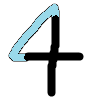
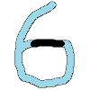
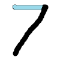
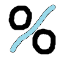
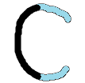
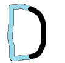
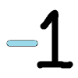
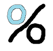

# Codepage

HBL's codepage has 16 characters, each representing one nybble (half a byte) of code. In other words, if the packed code is written out in hexadecimal, each codepage character represents one hex digit. The characters have been chosen to be as memorable as possible, both in their connection to the associated hex digits and in their connection to the associated builtins.

## Hex digits and their codepage characters

| Hex | Chr | Mnemonic |
| --- | --- | -------- |
| `0` | `0` | |
| `1` | `1` | |
| `2` | `2` | |
| `3` | `<` |  |
| `4` | `+` |  |
| `5` | `*` | 5-pointed star (in some fonts) |
| `6` | `-` |  |
| `7` | `/` |  |
| `8` | `%` |  |
| `9` | `?` |  |
| `A` | `.` | |
| `B` | `,` | |
| `C` | `(` |  |
| `D` | `)` |  |
| `E` | `'` | **E**scape character |
| `F` | newline | **F**inal character on a line |

## Codepage characters and their builtin values

| Chr | Value | Mnemonic |
| --- | ----- | -------- |
| `0` | `0`   | |
| `1` | `1`   | |
| `2` | `2`   | |
| `<` | `3`   |  |
| `+` | `4`   |  |
| `*` | `5`   | 5-pointed star (in some fonts) |
| `-` | `-1`  |  |
| `/` | `7`   |  |
| `%` | `10`  |  |
| `?` | `()`  | Nil is falsey/questionable |
| `.` | arg1  | Represents the argument in jq, for instance |
| `,` | arg2  | Like a period, but extended |
